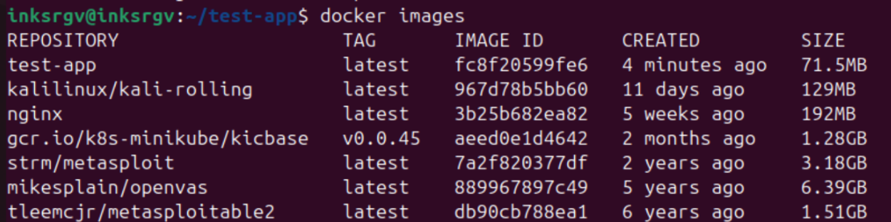

# Лабораторная работа №3

## Задание
Поднять kubernetes кластер локально (например minikube), в нём развернуть свой сервис, используя 2-3 ресурса kubernetes. В идеале разворачивать кодом из yaml файлов одной командой запуска. Показать работоспособность сервиса.
(сервис любой из своих не опенсорсных, вывод “hello world” в браузер тоже подойдёт)

## Ход выполнения работы

### Настройка окружения

Миникуб у меня был установлен, но вообще установить можно по [инструкции](https://minikube.sigs.k8s.io/docs/start/?arch=%2Fwindows%2Fx86-64%2Fstable%2F.exe+download).

Чтобы проверить, что миникуб установлен и работает, запустим локальный кластер:

Кластер запустился успешно. Проверим его статус:

Тоже все ок, можем идти дальше.

 Устанавливаем lens 

  
Идем на [официальный сайт](https://k8slens.dev/) и смотрим инструкцию по установке.

Получаем ключик: 
      
      curl -fsSL https://downloads.k8slens.dev/keys/gpg | gpg --dearmor | sudo tee /usr/share/keyrings/lens-archive-keyring.gpg > /dev/null

Указываем stable канал:

    echo "deb [arch=amd64 signed-by=/usr/share/keyrings/lens-archive-keyring.gpg] https://downloads.k8slens.dev/apt/debian stable main" | sudo tee /etc/apt/sources.list.d/lens.list > /dev/null

Устанавливаем lens:

    sudo apt install lens

Дальше регистрируемся и ура! приложение нам доступно:

### Разворачиваем сервис!

Для примера будем разворачивать простенькое приложение, которое открывает html-файл. Я такое уже писала для второй лабы, поэтому за основу возьмем его же. 

Первое, что нам нужно сделать - пересобрать наш Docker-образ:

Посмотрим теперь что наш образ виден:

Загружаем этот образ в minikube:

    minikube image load test-app

И идем писать манифесты! Для этой лабы их будет два: deployment и service.

Файл `deployment.yaml`

    apiVersion: apps/v1
    kind: Deployment
    metadata:
    name: test-app
    spec:
    replicas: 1
    selector:
    matchLabels:
      app: test-app
    template:
    metadata:
      labels:
        app: test-app
    spec:
      containers:
      - name: test-app
        image: test-app
        ports:
        - containerPort: 5000

Файл `service.yaml`

    apiVersion: v1
    kind: Service
    metadata:
    name: test-app-service
    spec:
    selector:
    app: test-app
    ports:
    - protocol: TCP
      port: 80
      targetPort: 5000
    type: NodePort

Запускаем!(как и просили, одной командой)

Глядим что получилось:

Видим ошибку ImagePullBackOff. Увидела в комментариях к лабам, что не только я столкнулась с этой проблемой, поэтому подглядела решение у ребят :) Спасибо Вам коллеги🤝

Итак, в файл `service.yaml` была добавлена строчка 

    imagePullPolicy: Never

Перезапускаем наш сервис иииии..... ловим новую ошибку

Ошибка говорит мне лишь о том, что под валит тесты и не работает, поэтому бежим смотреть логи:

Мда, не этого я ожиидала. Меняем рабочую директорию в Dockerfile, потому что я забыла ее поменять)

Пересобираем образ, перезапускаем сервис, и получаем новую ошибку!

Я забыла загрузить образ :). 

Загружаем образ с помощью команды

    minikube image load test-app

Запускаем сервис и ... это победа!

Посмотрим как это выглядит в lens: 

Эстетично

Теперь чекнем работающие сервисы:

Перейдем по ссылке и..

Ура! Работает)

Поглядим на мой кластер:

Ну красота!

### Вывод

В ходе выполнения лабораторной работы я подняла сервис в minikube. Это не первый мой опыт работы с minikube, однако сложности, как можно заметить, возникали) В целом, работой я довольна, узнала о новом инструменте и вспомнила как работать с minikube.

